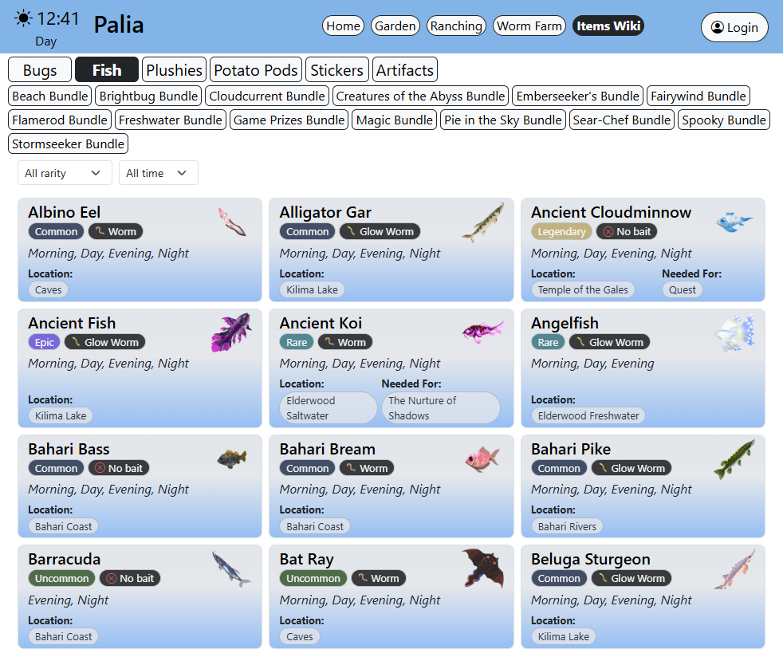
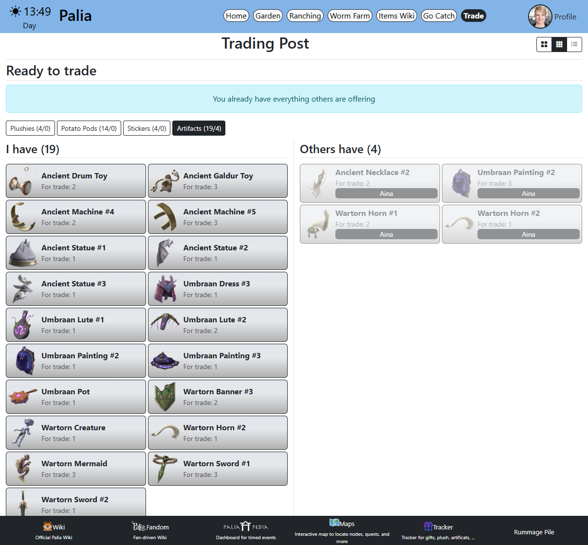
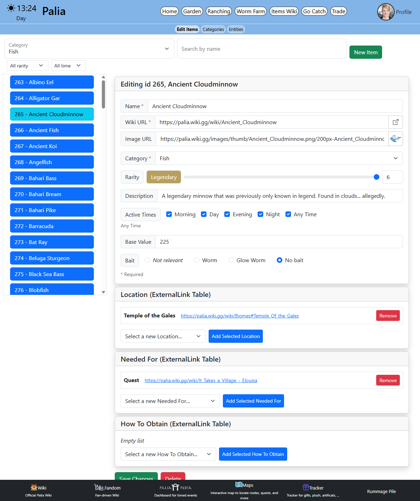

## Palia Mini‑Wiki

This project is a mini‑wiki for the game Palia. It provides a quick reference to selected game features, lets users look up information about creatures, and register tradeable items in their inventory. It is a single repository with a React frontend and a Node/Express backend.

### Screenshots

#### Wiki

Browse selected game features and look up creatures and items by category.



#### Trading Post

Logged-in users register items they have spare and can see who has what available to trade.



#### Admin Panel

Admin users manage the catalogue, categories and wiki entries through a protected interface.



### Technologies Used

-   Frontend
    -   React 19, TypeScript, Vite 7
    -   TanStack Router (file-based), TanStack Query
    -   Bootstrap 5, Bootstrap Icons
    -   Formik + Yup (item forms)
    -   Google OAuth (`@react-oauth/google`)
-   Backend
    -   Node.js, Express 5, TypeScript (run via `tsx`)
    -   MySQL (via mysql2)
    -   Swagger (swagger-jsdoc, swagger-ui-express) — API docs at `/palia/api-docs`
-   Shared
    -   `shared/` — local TypeScript package (`@palia/shared`) consumed by both client and server via `file:` dependency

### Repository Structure

-   `client/` — React + Vite app (served under base path `/palia/`)
-   `server/` — Node/Express API (mounted at `/palia`)
-   `shared/` — shared TypeScript types (`Item`, `Category`, `TradeOffer`, etc.)
-   `env/` — environment files (e.g., `.env.palia`) used by the backend

### Prerequisites

-   Node.js 18+ and npm
-   MySQL server

### Environment

The backend loads environment variables from `env/.env.palia`. Create this file before starting the server.

Required variables:

-   `FRONTEND_URL` — frontend origin for CORS (default `http://localhost:5173`)
-   `DB_HOST` — MySQL host
-   `DB_USER` — MySQL user
-   `DB_PASSWORD` — MySQL password
-   `DB_NAME` — MySQL database name

Frontend variables (`client/.env.development`):

-   `VITE_GOOGLE_CLIENT_ID` — Google OAuth client ID
-   `VITE_API_URL` — backend URL (default `http://localhost:8080/palia`)
-   `VITE_BASEURL` — frontend base URL

### Running Locally

Install shared package first (required by both sides):

```bash
cd shared
# no install needed — consumed directly as a file: dependency
```

Run backend (port 8080):

```bash
cd server
npm install
npm start        # runs: tsx server.ts
```

Run frontend (Vite dev server at port 5173):

```bash
cd client
npm install
npm run dev
```

Notes:

-   The API is mounted at `/palia` (e.g., `http://localhost:8080/palia`).
-   The frontend is built with base path `/palia/` to align with the backend route prefix.
-   By default, the backend allows CORS from `http://localhost:5173` unless overridden via `FRONTEND_URL`.

### Scripts

-   `client/`
    -   `npm run dev` — start Vite dev server
    -   `npm run build` — type-check (`tsc -b`) and build for production
    -   `npm run lint` — run ESLint
    -   `npm run preview` — preview production build
-   `server/`
    -   `npm start` — start API (`tsx server.ts`)
    -   `npm run typecheck` — type-check without emitting (`tsc --noEmit`)
